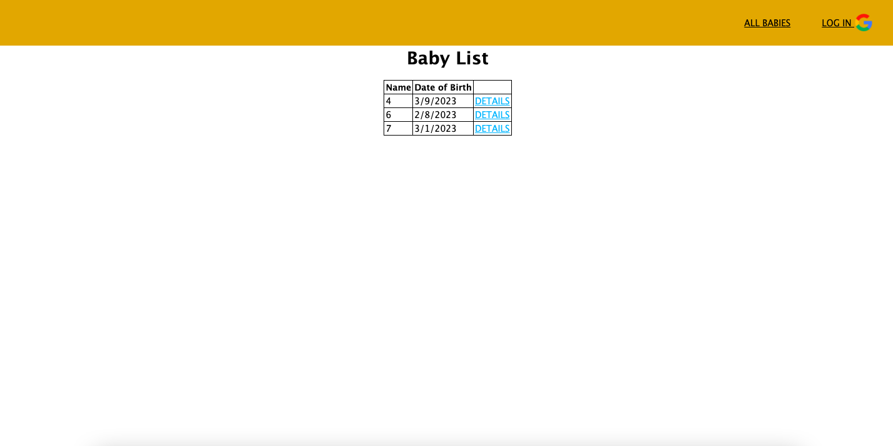
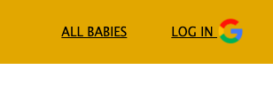
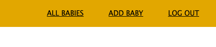
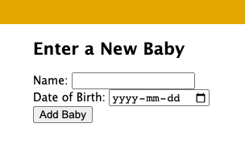
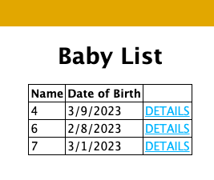
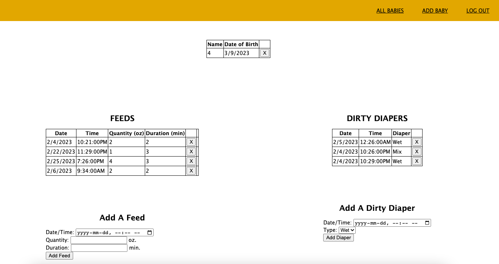

# **Baby-Beeznz**

Baby Beeznz is a database designed for parents to keep track of their new baby.  The application allows users to log feedings and dirty diapers.

## Technologies Used

* HTML
* CSS
* JavaScript
* MongoDB

## Getting Started

Click the link below to access the Trello workboard.

[https://trello.com/b/Y7UKHT1P/baby-tracker]

Click the link below to access the deployed app.

[https://babybeeznz.herokuapp.com/]

1. The main page displays all babies, as well as a navigation bar at the top.

2. Log in to allow appropriate access to add records.

3. After logging in, you are able to add a new baby.

4. To add a new baby, fill out the form and submit to add a new baby.

5. Here is where all the important information related to the baby is.  On the left you can find information for feeds, and on the right you can find information for dirty diapers.

4. Once a turn, click a cell to guess where the PC battleships are.

## Next Steps

* Finish update for all models
* Include sleep model
* Add view for seeing trends
* Track changes for checking current vs historical records